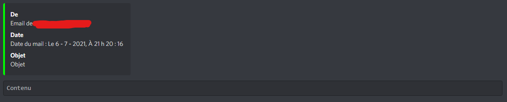
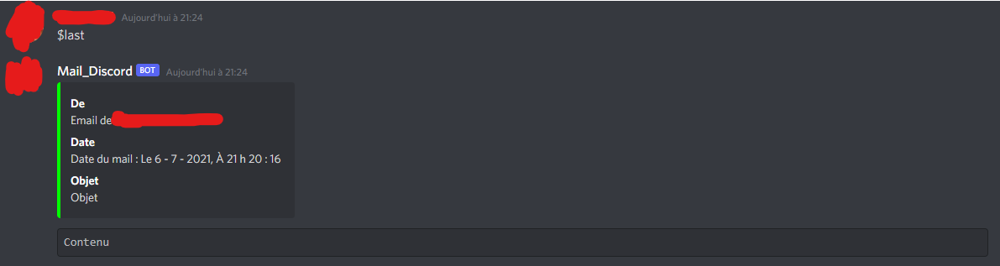
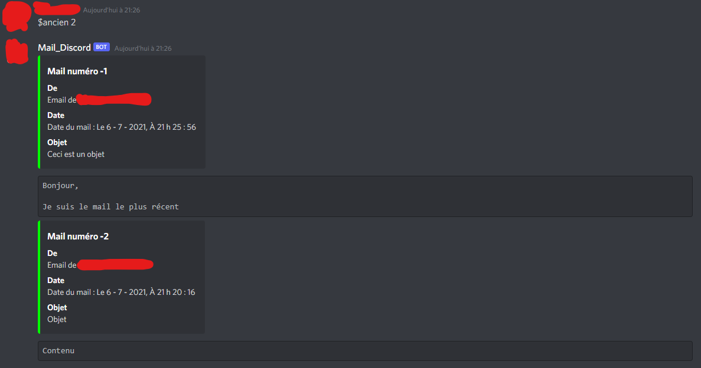

# Discord-Mail-Bot
Recevoir ses mails Gmail sur Discord grâce à ce BOT

Ce projet à été créé dans le but de recevoir ses mails scolaires sur Discord.

# Utilisation

$last     -> Renvoie le dernier mail reçu

$ancien x -> Renvoie les x derniers mails

Pour tout nouveau mail, le Bot l'envoie automatiquement dans le Channel correspondant (ID_CHANNEL à configuré)

Pour les mails avec un long contenu, il sera scindé en plusieurs messages

# Configuration

Au début du script Python, des variables sont à modifier :
  - `mail_login`  Adresse mail Gmail
  - `mail_pswd`   Mot de passe d'application Google (https://security.google.com/settings/security/apppasswords)
  - `mail_label`  Libellé des mails à afficher, INBOX -> Boîte de réception (déconseillé pour éviter de montrer les mails perso)
  - `IMAP_SERVER` Serveur IMAP (Gmail par défaut)
  - `ID_CHANNEL`  ID du Channel Discord (Clic droit -> Copier l'identifiant)
  - `TOKEN`       Token de l'application discord (https://discordapp.com/developers/applications)
  - `time_wait`   Temps d'attente entre chaque message
  - `limite_mail` Limiter le nombre de mails pour éviter le spam
  - `PREFIX`      Changer le caractère préfixe ($ par défaut)

Pour inviter le Bot sur un serveur, crée un lien de ce type :

  https://discordapp.com/oauth2/authorize?client_id= _**OAuth2 CLIENT ID**_ &scope=bot&permissions=0
